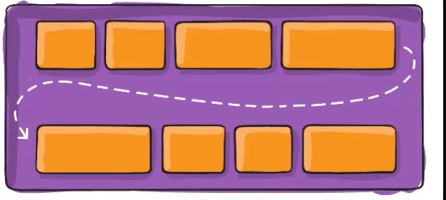
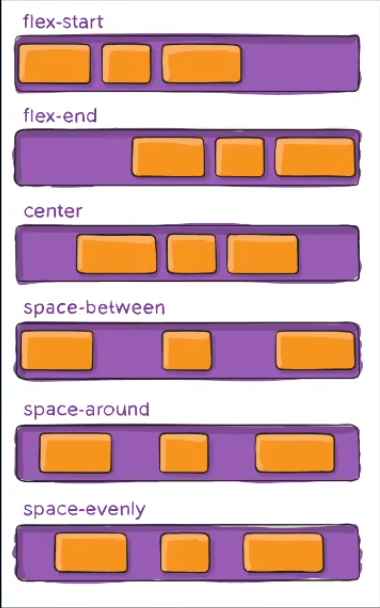
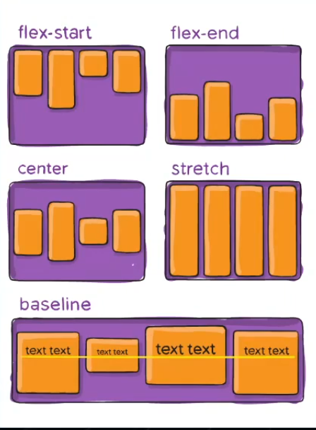
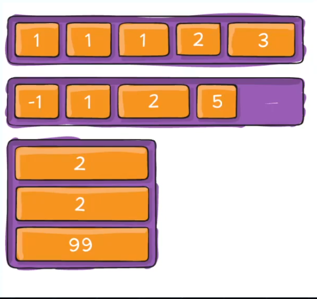
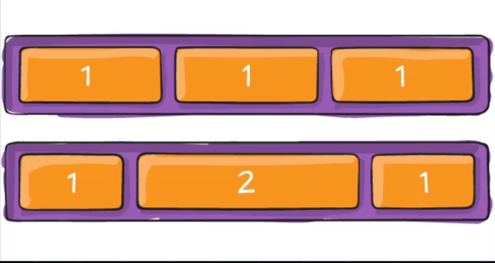
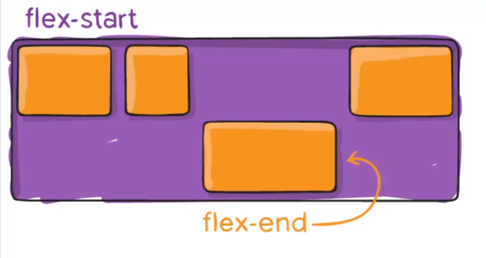

# Site-Jornada-Viagens
Curso Responsividade Frontend React


```
Unidades de medida CSS

2 tipos de medina

- Fixa = Não se adaptam
  "px", "cm"
  * Rigida quebre, tipografias ilegíveis, experiencia comprometida

- Relativas = Podem se adapatar a algo
  "%", "em", "rem", "vh", "vw"

Proporções ao invés valores fixos
- "%" --> referente ao elemento PAI (larguras fluídas, margen, padding)
- "em" --> medidas gerlemnte de tipografica, relativa ao tamanho de font do elemento Pai (efeito cascata, acumula o tamanho de cada pae) [Pai(30px) * 1.5 = 45px]
- "rem" --> Mais usado em tipografias, relativo ao root do html (padroniza tipografia e espeçamentos)
[
  html {
    font-size: 16px;
  }
  div{
    width: 12.5rem; /* 12.5 * 16 = 200 */
  }
  div p {
    font-size: 1.5rem; /* 16 * 1.5 = 24px */
  }
]

- "vw" e "vh" (View width e View Heigth) --> Usados em banners fullscreen, slides, layouts hero (conteudo visivel antes do scroll) [Pode gerar rolagem extra em MOB!!!!]

ler CSS SECRET
```
---

# CSS Media Queries

Condições que aplicam estilos diferentes em telas diferentes

## Sintaxe:
**@** - indica um at-rule
**media** - significa que a regra vai depender de características da mídia
**screen** - tipo de midia (tela)
**and** - operador lógico, combina condições
**(max-width: 768px)** - condição de largura
**{}** - estilos aplicados na condição

```
@media screen and (max-width: 768px){ /*até 768px essas condições são aplicadas*/
  body{
    background: blue;
  }
}
```

---

# Conceito Importante Antes de iniciar hands-on! ==> Mobile First
-> Primeiro desenvolver pelo mobile

# Progressive Emhamcement --> Melhorias progressivamente 

---

# Flexbox

-> Containers = qualquer objeto que possa conter outros objetos dentro
```
.container{
  display: flex; /*para se comportar de maneira flex*/

}
```

### Flex-direction = indica a direção dos itens
row = esquerda para direita
row-reverse = direita para esquerda
column = mesmo que o row mas de cima para baixo


```
 _      _      _      _
|_| -> |_| -> |_| -> |_|  = row
 _      _      _      _
|_| <- |_| <- |_| <- |_|  = row-reverse

column  |  column-reverse
   _             _
  |_|           |_|
   |             ^
   v             |
   _             _
  |_|           |_|
   |             ^
   v             |
   _             _
  |_|           |_|


.container{
  display: flex;
  flex-direction: flex-direction: row | row-reverse | column | column-reverse
}

```

### flex-wrap = controle de quebra de linha
nowrap = todos os flex itens ficarão em uma só linha
wrap = quebram em multiplas linhas de cima para baixo
wrap-reverse = quebram em multiplas linhas de baixo para cima

```
 _  _  ___  _____
|_||_||___||_____| ---
  ___________________|
  |    _  _  ___  _____
  |-> |_||_||___||_____|
  
```

### Justify-content = alinha os itens ao longo do eixo principal



### Align-itens = alinhas os itens no eixo transversal


###  Align-content = alinhas as linhas quando temos multiplas linhas no eixo vertical


## Organizar itens FILHOS

### Order = define a ordem visual dos itens sem alterar o HTML


### flex-grow / flex-shrink = quanto um item pode crescer/encolher para ocupar o espaço


### align-self = sobreescreve o alinhamento transversal do item indiidual


https://www.alura.com.br/artigos/css-guia-do-flexbox?utm_source=gnarus&utm_medium=timeline

---